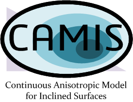

# CAMIS for path planning
> PYTHON package including CAMIS and biOUM path planner

*Author:* [J. Ricardo Sánchez Ibáñez](https://github.com/JRicardoSan) 

*Supervisor:* [Carlos J. Pérez del Pulgar](https://github.com/carlibiri) 

*Contact info:* ricardosan@uma.es

*Affiliation:* University of Malaga, [Space Robotics Lab](https://www.uma.es/robotics-and-mechatronics/info/107542/robotica-espacial/)

## Overview
The main purpose of this repository is to provide the resources needed to create a CAMIS for any mobile robot that must traverse irregular terrain. Besides, it is also provided the implementation of a fast and continuous anisotropic planner, based on the bi-directional Ordered Upwind Method (bi-OUM).

CAMIS is basically a method to make a path planner acknowledge the fact that the direction and magnitude of any slope takes influence on the performance of a mobile robot. 

To demonstrate its utility, it is also provided an example in which a experimental robot and terrain from the University of Malaga are employed.

## Step-by-Step

1. Collect robot data, in the form of cost values together with their associated robot orientations (using roll-pitch-yaw angles).

2. Compute the 4 CAMIS directional functions: Descent Cost, Ascent Cost, Lateral Cost 1 and Lateral Cost 2.

3. Get a DEM and compute the slopes.

4. Prepare a triangular grid in which each node has associated a value of gradient and an aspect vector.

5. Execute biOUM using CAMIS to obtain an optimal and feasible path.
